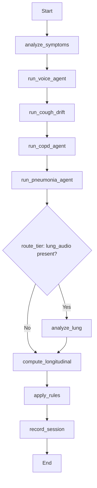

# Boundary Conditions and Threshold Justification

This document provides a traceable audit of boundary conditions used in the respiratory triage system.

Classification used in this document:
- **Guideline-inspired**: motivated by clinical guidelines, but numeric cutoffs are implementation choices.
- **Data-calibrated**: selected from validation data during training.
- **Heuristic**: engineering or product choice with no direct paper-derived numeric value.

## 1) LangGraph Flow (Mermaid)

Source: `pipeline/triage_graph.py`.

## 2) Rule Engine Boundaries

Source: `pipeline/rule_engine.py`.

| Parameter / Rule | Value | Why used | Category | Code reference |
|---|---:|---|---|---|
| High confidence cutoff | 0.70 | Trigger high-severity branches for COPD/pneumonia | Guideline-inspired | `rule_engine.py:25` |
| Moderate confidence cutoff | 0.50 | Trigger moderate-risk GP review branches | Heuristic | `rule_engine.py:26` |
| COPD exacerbation cough severity | >= 6/10 | Escalation marker with dyspnea or severe cough | Guideline-inspired | `rule_engine.py:67` |
| Pneumonia age criterion | >= 65 | Higher-risk CAP profile in triage logic | Guideline-inspired | `rule_engine.py:87` |
| Sound fallback confidence | 0.6 | Default when sound confidence missing | Heuristic | `rule_engine.py:136`, `rule_engine.py:151` |
| Symptom-only pneumonia hint trigger | >= 0.35 | Tier-1 escalation without stethoscope audio | Heuristic | `rule_engine.py:169` |
| Symptom-only COPD hint trigger | >= 0.35 | Tier-1 COPD flag | Heuristic | `rule_engine.py:184` |
| Longitudinal escalation trigger | >= 0.40 | Escalate moderate concern based on composite trend | Heuristic | `rule_engine.py:198` |
| General symptomatic trigger | >= 0.40 | Moderate concern when symptom probability is high | Heuristic | `rule_engine.py:213` |
| Healthy confidence floor | min floor 0.70 via max(...) | Prevent low-confidence “no pathology” result | Heuristic | `rule_engine.py:228` |

## 3) Longitudinal Composite Boundaries

Source: `pipeline/longitudinal.py`.

| Parameter | Value | Why used | Category | Code reference |
|---|---:|---|---|---|
| Symptom weight | 0.50 | Symptoms are primary signal in self-screening | Heuristic | `longitudinal.py:20` |
| Voice weight | 0.35 | Voice biomarkers as secondary signal | Heuristic | `longitudinal.py:21` |
| Cough drift weight | 0.15 | Drift contributes but less than symptoms/voice | Heuristic | `longitudinal.py:22` |
| MCID threshold | 0.05 | Meaningful per-session change on 0-1 scale | Guideline-inspired | `longitudinal.py:25` |
| Interpret score bins | 0.20/0.40/0.60/0.80 | UI/clinical interpretation buckets | Heuristic | `longitudinal.py:92`, `longitudinal.py:98`, `longitudinal.py:104`, `longitudinal.py:110` |

## 4) Symptom Agent Boundaries

Source: `agents/symptom_agent.py`.

### 4.1 Composite symptom index weights

| Feature | Weight | Rationale | Category | Code reference |
|---|---:|---|---|---|
| Dyspnea | 0.25 | strongest respiratory burden indicator | Guideline-inspired | `symptom_agent.py:66` |
| Cough severity | 0.20 | major respiratory symptom | Guideline-inspired | `symptom_agent.py:67` |
| Chest tightness | 0.15 | airway discomfort burden | Guideline-inspired | `symptom_agent.py:68` |
| Fever | 0.12 | infection marker | Guideline-inspired | `symptom_agent.py:69` |
| Sleep quality | 0.10 | CAT-like quality-of-life item | Guideline-inspired | `symptom_agent.py:70` |
| Energy level | 0.08 | CAT-like functional burden | Guideline-inspired | `symptom_agent.py:71` |
| Sputum | 0.06 | secretion character burden | Guideline-inspired | `symptom_agent.py:72` |
| Wheeze | 0.04 | supportive airway symptom | Guideline-inspired | `symptom_agent.py:73` |

### 4.2 Risk adjustments and triggers

| Parameter | Value | Why used | Category | Code reference |
|---|---:|---|---|---|
| Symptom MCID | 0.05 | maps CAT MCID into normalized scale | Guideline-inspired | `symptom_agent.py:30` |
| Age factor (>=40) | +0.02 | early risk adjustment | Heuristic | `symptom_agent.py:123` |
| Age factor (>=50) | +0.05 | higher baseline risk | Heuristic | `symptom_agent.py:122` |
| Age factor (>=65) | +0.08 | highest age risk bucket | Heuristic | `symptom_agent.py:121` |
| COPD factor: resp condition | +0.40 | known respiratory history strongly weighted | Guideline-inspired | `symptom_agent.py:128` |
| COPD factor: dyspnea level >=2 | +0.25 | breathlessness as significant risk marker | Guideline-inspired | `symptom_agent.py:129` |
| COPD factor: wheeze | +0.15 | supports obstructive phenotype | Guideline-inspired | `symptom_agent.py:130` |
| COPD factor: age >=40 | +0.10 | age-associated risk | Guideline-inspired | `symptom_agent.py:131` |
| COPD factor: age >=65 | +0.10 | additional late-age risk | Guideline-inspired | `symptom_agent.py:132` |
| Pneumonia factor: fever | +0.45 | strongest CAP symptom indicator in model | Guideline-inspired | `symptom_agent.py:137` |
| Pneumonia factor: dyspnea >=2 | +0.25 | respiratory distress indicator | Guideline-inspired | `symptom_agent.py` |
| Pneumonia factor: cough_norm >=0.7 | +0.20 | severe cough threshold | Heuristic | `symptom_agent.py` |
| Pneumonia factor: congestion | +0.10 | supportive symptom | Heuristic | `symptom_agent.py` |
| Symptomatic detection threshold | >=0.35 | binary symptomatic flag | Heuristic | `symptom_agent.py` |

## 5) Voice Agent Boundaries

Source: `agents/voice_agent.py`.

| Parameter | Value | Why used | Category | Code reference |
|---|---:|---|---|---|
| Min duration | <1.0 sec rejected | too short for stable phonation features | Heuristic | `voice_agent.py:95` |
| Max window | >8.0 sec trimmed to middle 8 sec | stabilize extraction on most stationary segment | Heuristic | `voice_agent.py:99` |
| Silence threshold | RMS <0.001 rejected | avoid silent/noisy clips | Heuristic | `voice_agent.py:114` |
| Voice index weights | jitter/shimmer/hnr=0.25, f0_std=0.15, duration=0.10 | respiratory relevance weighting | Guideline-inspired | `voice_agent.py:41`-`voice_agent.py:45` |
| Feature MCID anchors | jitter 0.002, shimmer 0.020, hnr 2.0, f0_std 5.0, duration 1.0 | minimum meaningful change anchors | Guideline-inspired | `voice_agent.py:51`-`voice_agent.py:55` |

## 6) Model Training and Operating Thresholds

### 6.1 Binary disease models (COPD/Pneumonia)

Source: `scripts/train_binary_agent.py`, `scripts/train_pneumonia_cv.py`.

| Parameter | Value | Why used | Category | Code reference |
|---|---:|---|---|---|
| Target recall constraint | 0.80 | enforce high sensitivity before selecting threshold | Data-calibrated policy | `train_binary_agent.py:44`, `train_pneumonia_cv.py:45` |
| Threshold sweep range | 0.20 to 0.70 step 0.01 | validation sweep under recall constraint | Data-calibrated | `train_binary_agent.py` threshold loop, `train_pneumonia_cv.py` threshold loop |
| Base model hyperparams | hidden=[256,64], dropout=0.3, lr=3e-4, wd=1e-4 | stable OPERA embedding classifier setup | Heuristic (standard practice) | `train_binary_agent.py:37`-`train_binary_agent.py:43` |

### 6.2 Cough model

Source: `scripts/train_cough_agent.py`.

| Parameter | Value | Why used | Category | Code reference |
|---|---:|---|---|---|
| Threshold sweep range | 0.30 to 0.80 step 0.01 | maximize macro F1 on val set | Data-calibrated | `train_cough_agent.py:175` |
| Batch/LR/Dropout | 64 / 1e-3 / 0.3 | classifier optimization setup | Heuristic | `train_cough_agent.py:38`-`train_cough_agent.py:40` |
| Patience | 12 | regularization via early stopping | Heuristic | `train_cough_agent.py:118` |

### 6.3 Sound 3-class model

Source: `scripts/train_sound_3class.py`.

| Parameter | Value | Why used | Category | Code reference |
|---|---:|---|---|---|
| Label merge | class 3 (Both) -> 1 (Crackle) | class sparsity and clinical dominance assumption | Heuristic/data pragmatic | `train_sound_3class.py` dataset and split preprocessing |
| Base hyperparams | hidden=[512,256,64], dropout=0.3, lr=3e-4 | stable 3-class training on embeddings | Heuristic | `train_sound_3class.py` config block |

## 7) References Mentioned in Codebase

From comments/docstrings currently present in repository:
- GOLD 2024 (Global Initiative for Chronic Obstructive Lung Disease)
- BTS 2023 CAP guideline
- GINA 2023 (Global Initiative for Asthma)
- Jones et al. (2009), ERJ: CAT development and validation
- Kon et al. (2014), Lancet Respir Med: CAT MCID
- Bartl-Pokorny et al. (2021), JASA: COVID voice biomarker study
- Shastry et al. (2014), Int J Phonosurg Laryngol: COPD voice analysis
- Boersma and Weenink (Praat reference)

## 8) Publication Notes (Recommended)

For a methods section, report constants in three buckets:
1. **Guideline-inspired constants** (clinical rationale provided, but numeric value adapted in this implementation).
2. **Data-calibrated constants** (chosen on validation folds, e.g., operating thresholds under recall constraints).
3. **Heuristic constants** (engineering defaults, UI bins, fallbacks).

To strengthen reproducibility claims, include:
- sensitivity analysis for major heuristic thresholds (`HIGH_CONF`, `MOD_CONF`, symptom hint cutoffs, longitudinal bins),
- calibration plots and decision curves for selected model thresholds,
- ablation table for symptom/voice/drift fusion weights.
